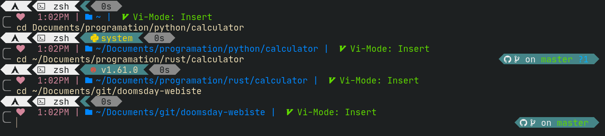

<h2 align="center">The Doom zsh theme</h2>

<div align="center">
  <h5>
    <a href="https://spaceship-prompt.sh">Website</a> |
    <a href="https://spaceship-prompt.sh/getting-started">Installing</a> |
    <a href="#features">Features</a> |
    <a href="https://spaceship-prompt.sh/options">Options</a> |
    <a href="https://spaceship-prompt.sh/api">API</a>
  </h5>
</div>
 
  
## Features
- Current Vi-mode mode ([with handy aliases for temporarily enabling](./docs/options.md#vi-mode-vi_mode)).
- Optional exit-code of last command ([how to enable](./docs/options.md#exit-code-exit_code)).
- Optional time stamps 12/24hr in format ([how to enable](./docs/options.md#time-time)).
- Execution time of the last command if it exceeds the set threshold.
- Optional AWS now supports aws-vault ([aws-vault](https://github.com/99designs/aws-vault))
Want more features? Please, [open an issue](https://github.com/spaceship-prompt/spaceship-prompt/issues/new/choose) or send pull request.

## Requirements

To work correctly, you will first need:

- [`zsh`](http://www.zsh.org/) (v5.2 or recent) must be installed.
- [Powerline Font](https://github.com/powerline/fonts) must be installed and used in your terminal (for example, switch font to [Fira Code](https://github.com/tonsky/FiraCode)).

## Installing
Now that the requirements are satisfied, you can install Spaceship ZSH via any of the following tools.

### [oh-my-zsh]

Clone this repo:

```zsh
git clone https://github.com/CMOISDEAD/doom-zsh.git "$ZSH_CUSTOM/themes/doom-prompt" --depth=1
```

Symlink `doom.zsh-theme` to your oh-my-zsh custom themes directory:

```zsh
ln -s "$ZSH_CUSTOM/themes/doom-prompt/doom.zsh-theme" "$ZSH_CUSTOM/themes/doom.zsh-theme"
```

Set `ZSH_THEME="doom"` in your `.zshrc`.

## Related Projects

Here's a list of related projects that have been inspired by Spaceship ZSH.

- [**matchai/spacefish**](https://github.com/matchai/spacefish) - A port of Spaceship ZSH for fish shell intending to achieve complete feature parity.
- [**starship/starship**](https://github.com/starship/starship) - A blazing-fast, cross-shell prompt written in Rust, heavily inspired by Spaceship ZSH.
