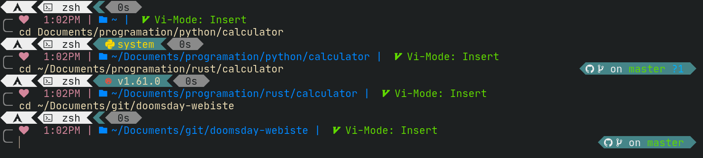

<h2 align="center">The Doom zsh theme</h2>

<div align="center">
  <h5>
    <a href="#installing">Installing</a> |
    <a href="#features">Features</a> |
    <a href="#options">Options</a>
  </h5>
</div>

## Overview

A zsh theme for developers, fully customizable and compatible with different development ecosystems, seamlessly integrated with git.

## Themes

To select a specific theme switch branches on github and select the theme or the full version.

#### Rainbow



#### Pure


## Features

- Multiple themes
- Display node.js, rust, python, ruby (and more) version.
- Multiple customizable sections.
- Customizable order.
- Very fast git update thanks to [romkatv](https://github.com/romkatv/gitstatus).
- Create your own section.
- and more!

## Requirements

To work correctly, you will first need:

- [`zsh`](http://www.zsh.org/) (v5.2 or recent) must be installed.
- [Powerline Font](https://github.com/powerline/fonts) must be installed and used in your terminal (for example, switch font to [Fira Code](https://github.com/tonsky/FiraCode)).
- [`gitstatus (romkatv)`](https://github.com/romkatv/gitstatus#using-from-zsh) romkatv gitstatus project.

## Installing

Now that the requirements are satisfied, you can install Spaceship ZSH via any of the following tools.

### [oh-my-zsh]

## install the gitstatus

```zsh
git clone --depth=1 https://github.com/romkatv/gitstatus.git ~/gitstatus
```

add this `source ~/gitstatus/gitstatus.prompt.zsh` at the begging of your ~/.zshrc file.

## install the theme

Clone this repo:

```zsh
git clone https://github.com/CMOISDEAD/doom-zsh.git "$ZSH_CUSTOM/themes/doom-prompt" --depth=1
```

Symlink `doom.zsh-theme` to your oh-my-zsh custom themes directory:

```zsh
ln -s "$ZSH_CUSTOM/themes/doom-prompt/doom.zsh-theme" "$ZSH_CUSTOM/themes/doom.zsh-theme"
```

Set `ZSH_THEME="doom"` in your `.zshrc`.

## Related Projects

Here's a list of related projects that have been inspired by Spaceship ZSH.

- [**spaceship-prompt/spaceship-prompt**](https://github.com/spaceship-prompt/spaceship-prompt) - Spaceship is a minimalistic, powerful and extremely customizable Zsh prompt. It combines everything you may need for convenient work, without unnecessary complications, like a real spaceship.
- [**starship/starship**](https://github.com/starship/starship) - A blazing-fast, cross-shell prompt written in Rust, heavily inspired by Spaceship ZSH.
